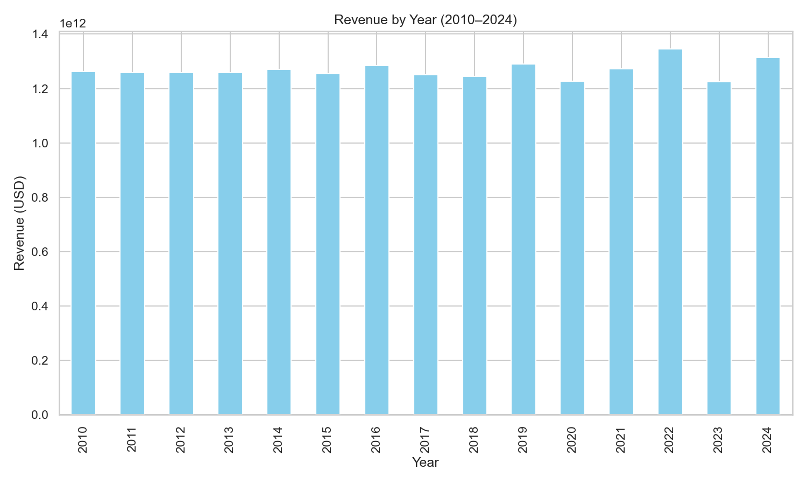
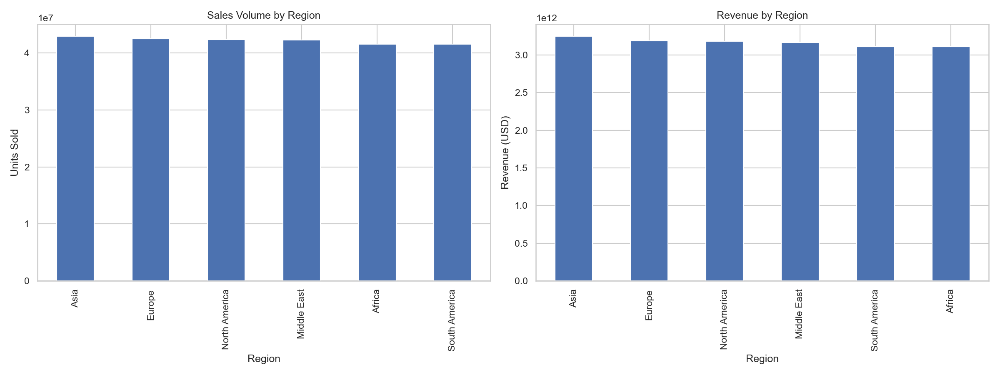
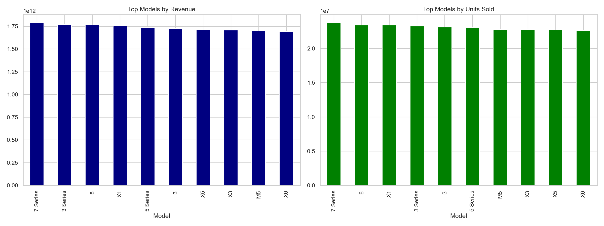

# BMW Sales Analysis 2010-2024

This project analyzes BMW’s global sales data from 2010 to 2024 to uncover trends in revenue, top-performing regions, and model performance. Includes data cleaning, exploratory analysis, and business-level recommendations for production, pricing, and marketing strategies.


## 📂 Project Structure
```
├── data/
│   └── BMW_sales_data_2010_2024.csv   # Raw dataset
├── outputs/                           # Exported charts
├── BMW_Sales_Analysis.ipynb           # Main Jupyter Notebook
├── README.md                          # Project documentation
```

### Main Jupyter Notebook  
You can view the full analysis in the Jupyter Notebook here:  
➡️ [BMW_Sales_Analysis.ipynb](https://github.com/francissibal/BMW_Sales_Analysis/blob/main/BMW%20Sales%20Analysis.ipynb)


---
## Executive Summary
**Objective:** Provide actionable insights into BMW’s sales (2010–2024) for better decision-making in production, pricing, and marketing.

**Key Insights:**
- **Best year for revenue:** 2022 with $1.344 trillion USD earned.
- **Top region by units sold:** Asia with 42.97M cars (~17% global share).
- **Top model by revenue:** 7 Series contributing $1.79 trillion USD.
- **Hybrid/EV adoption:** Appears flat (~51%) in dataset, but real-world trends show strong acceleration in Europe & North America.

---

## Exploratory Data Analysis

### Data Preview

| Model     | Year | Region         | Fuel_Type | Transmission | Price_USD | Sales_Volume |
|-----------|------|----------------|-----------|--------------|-----------|--------------|
| 5 Series  | 2016 | Asia           | Petrol    | Manual       | 98,740    | 8,300        |
| i8        | 2013 | North America  | Hybrid    | Automatic    | 79,219    | 3,428        |
| 7 Series  | 2020 | South America  | Diesel    | Manual       | 49,898    | 3,080        |
| X3        | 2024 | Middle East    | Petrol    | Automatic    | 60,971    | 4,047        |
| M5        | 2014 | Asia           | Diesel    | Automatic    | 102,778   | 632          |

---

### Key Visualizations & Insights  

**1. Revenue by Year (2010–2024)**  
  * BMW’s global revenue shows steady growth with a peak in **2022 ($1.344T).**
  
  * Post-2022, there’s a slight dip, likely tied to **supply chain challenges** and **increasing EV competition**.
  
  * The trend highlights **long-term growth potential** despite short-term fluctuations.

  

---

**2. Sales Volume by Region**  
Asia leads global unit sales, followed by Europe & North America.  

  

---

**3. Revenue by Model**  
7 Series dominates, followed by 5 Series and X models.  

  


---

## Business Recommendations
- **Focus on top performers** – Prioritize stocking and promoting 7 Series & 5 Series in Asia and Europe.  
- **Strengthen EV/Hybrid positioning** – Expand marketing in Europe & North America where adoption is accelerating.  
- **Improve data collection** – Collect monthly or transactional-level data for better demand forecasting.  
- **Enhance customer insights** – Link sales with customer demographics & feedback to refine product design and tailor campaigns.  

---

## 🛠️ Tools
- **Python** – Data cleaning & analysis  
- **Pandas, NumPy** – Data wrangling  
- **Matplotlib, Seaborn** – Visualizations  
- **Jupyter Notebook** – Documentation & storytelling  
